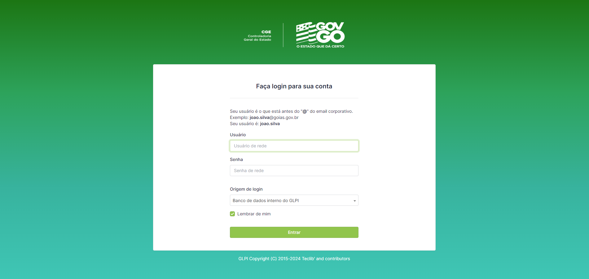
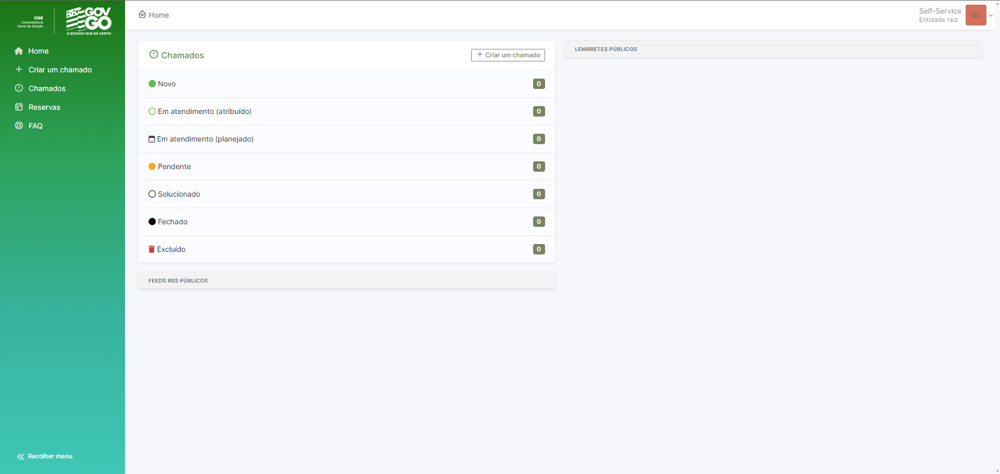
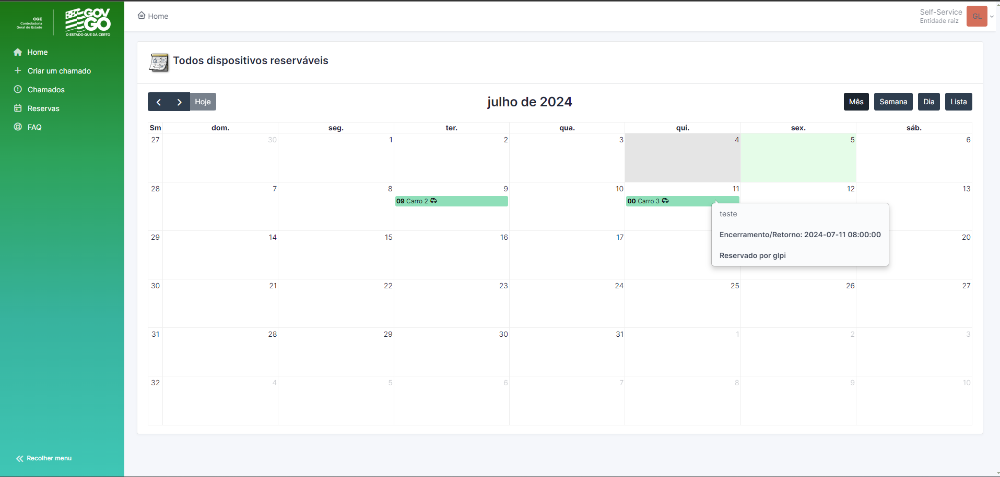

# GLPI da Controladoria-Geral do Estado de Goiás

Esta aplicação foi divulgada para todos os servidores a partir do dia 01/05/2024, havendo alta adesão do público-alvo (servidores desta controladoria).

# Novos recursos perante ao sistema antigo:

* **Continuidade dos Chamados**: Com o GLPI é possível enviar mais de 1 mensagem/resposta dentro de um único chamado, anexar itens após a abertura e também possibilita a reabertura de chamados.

* **Confirmações de Recebimento/Encerramento de Chamados via Email**: Os requerentes dos chamados, recebem um email após a abertura do chamado e ao encerramento, juntamento do envio da pesquisa de satisfação.

* **Relatórios e Painéis em Tempo Real**: Os painéis são atualizados em tempo real de acordo com os dados em sistema.

* **Design Intuitivo**: As interações em geral do GLPI são mais intuitivas que nosso sistema antigo, proporcionando assim, maior adesão dos servidores.

* **Reservas de Carros e Salas de Reunião**: A reserva dos itens citados anteriormente, eram feitas manualmente em ordens de tráfego impressas em papel A4. Atualmente todos os servidores podem efetuar/acompanhar as reservas e o setor responsável pelas reservas, pode gerenciar todas reservas efetuadas.

# Cronjobs executadas em nosso projeto:

##    * * * * * /usr/local/bin/glpi-cron.sh
* **Roda as cronjobs configuradas na interface a cada minuto:**

##    0 7 * * * /usr/local/bin/glpi-syncusers.sh c
* **Todo dia às 7h cria usuários do AD:**
##    0 7 * * * /usr/local/bin/glpi-syncusers.sh u
* **Todo dia às 7h atualiza usuários do AD:**
##    0 7 * * * /usr/local/bin/glpi-locales.sh
* **Todo dia às 7h compila os arquivos de tradução:**
##    2 7 * * * /usr/local/bin/glpi-clearcache.sh
* **Todo dia às 7h02m limpa o cache:**

# Algumas prints

**Login**

**Tela Inicial**

**Calendário de Reservas**

 

